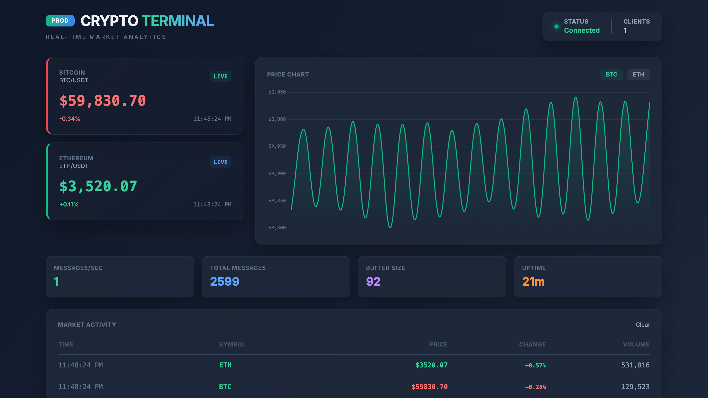

# 🚀 Crypto Kafka Streaming Terminal

A production-grade, real-time cryptocurrency data streaming platform. This project demonstrates high-throughput data processing using Apache Kafka, Node.js, and WebSockets with a cinematic dark-mode dashboard.



## 🏗️ System Architecture

The project follows a modular microservices-style architecture to ensure scalability and clean separation of concerns.

- **Producer**: Fetches/Simulates live crypto market data and streams it to Kafka
- **Kafka Cluster**: Hosted on Aiven Cloud, handling high-frequency message topics
- **Consumer & Server**: Reads the Kafka stream and broadcasts data via Socket.io
- **Frontend**: A modern, "Binance-style" dashboard built with Tailwind CSS & Chart.js

## ✨ Key Features

### 🛠 Technical Excellence
- **Production-Ready**: Environment-based config validation, structured logging (Winston), and centralized error handling
- **Enterprise Security**: Secure Kafka connectivity via SSL/TLS encryption with CA certificates
- **Containerized**: Fully Dockerized for seamless deployment across any environment
- **Robust Testing**: Unit and integration tests using Jest (80% coverage target)

### 📈 Business & UI Features
- **Multi-Asset Support**: Live tracking for BTC, ETH, BNB, ADA, and SOL
- **Zero-Lag Updates**: Real-time price updates using WebSockets
- **Cinematic Dashboard**: Dark-mode UI with live trend indicators and price charts
- **Metrics Tracking**: Real-time monitoring of message rates, buffer size, and system uptime

## 🚀 Quick Start

### 1. Prerequisites
- Node.js (>= 18.0.0)
- A Kafka Broker (Aiven Cloud / Upstash)
- ca.pem (SSL certificate for Kafka)

### 2. Setup
```bash
# Clone the repository
git clone https://github.com/ChanukaWeerakkody/kafka-crypto-project.git
cd kafka-crypto-project

# Install dependencies
npm install

# Setup environment variables
cp .env.example .env
# Update .env with your Kafka credentials
```

### 3. Run the App
```bash
# Start all services locally
./start-local.sh

# Or start individually
npm run dev:producer   # Start feeding data
npm run dev:dashboard  # Start UI & Consumer
```

Open http://localhost:3000 to view the live dashboard.

## ⚙️ Configuration (.env)

| Variable | Description | Default |
|----------|-------------|---------|
| KAFKA_BOOTSTRAP_SERVERS | Kafka broker URL | Required |
| KAFKA_TOPIC | Topic name for streaming | hi |
| SERVER_PORT | Dashboard port | 3000 |
| KAFKA_CA_CERT | Path to your ca.pem file | ./ca.pem |

## 🛡️ Security & Performance

- Non-root Docker containers for enhanced runtime security
- Input sanitization using Joi for all data points
- Connection pooling and message buffering for optimized memory usage

## 🧪 Testing

```bash
npm test              # Run all tests
npm run test:coverage # Generate coverage report
```

## 👨‍💻 Author

**Chanuka Weerakkody**

- LinkedIn: [Profile](https://linkedin.com/in/chanukaweerakkody)
- GitHub: [@ChanukaWeerakkody](https://github.com/ChanukaWeerakkody)